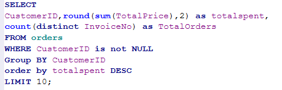
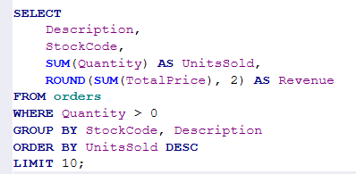
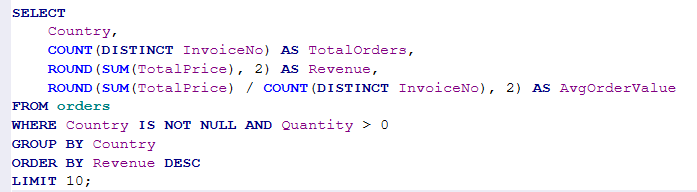
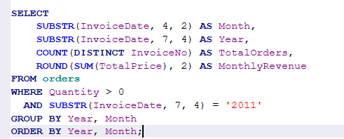

# Online Retail Sales Analysis using SQL

## Project Goal
Analyzed 540K+ retail transactions to extract business insights on customers, products, and revenue trends using SQLite.

## Tools Used
- SQLite / DB Browser for SQLite
- SQL: GROUP BY, JOIN, SUBSTR, Aggregations

## Key Queries & Insights

### 1. Top 10 VIP Customers
Identified highest-spending customers for loyalty campaigns.

### 2. Best Selling Products  
Found top products by units sold to optimize inventory.

### 3. Revenue by Country
UK generates 82% of total revenue. Clear market dependency.

### 4. Monthly Revenue Trends 2011
May 2011 was peak revenue month with $221K. Seasonality detected.

## Business Recommendations
1. **Target VIPs**: Create loyalty program for top 10 customers who drive major revenue
2. **Stock Best Sellers**: Increase inventory for top 10 products to avoid stockouts  
3. **Expand Markets**: Diversify beyond UK to reduce geographic risk
4. **Prep for May**: Ramp up marketing/inventory before May peak season

## Files
- `1_vip_customers.csv` - Top customers by revenue
- `2_best_products.csv` - Best selling products by quantity
- `3_country_revenue.csv` - Revenue breakdown by country  
- `4_monthly_trends.csv` - 2011 monthly performance
